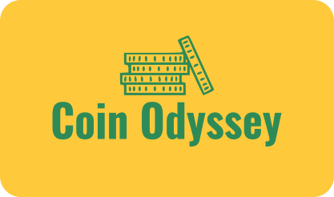
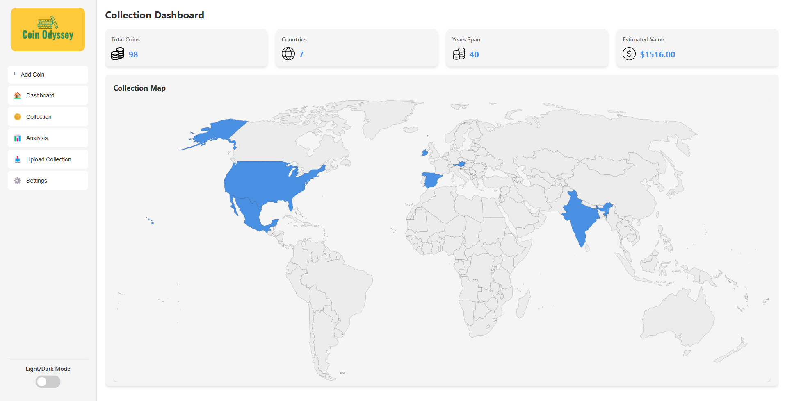
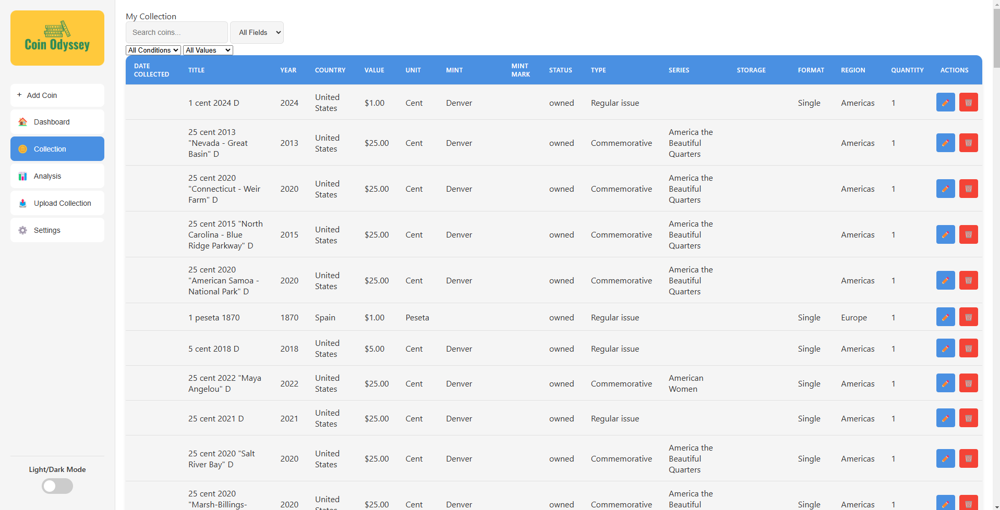
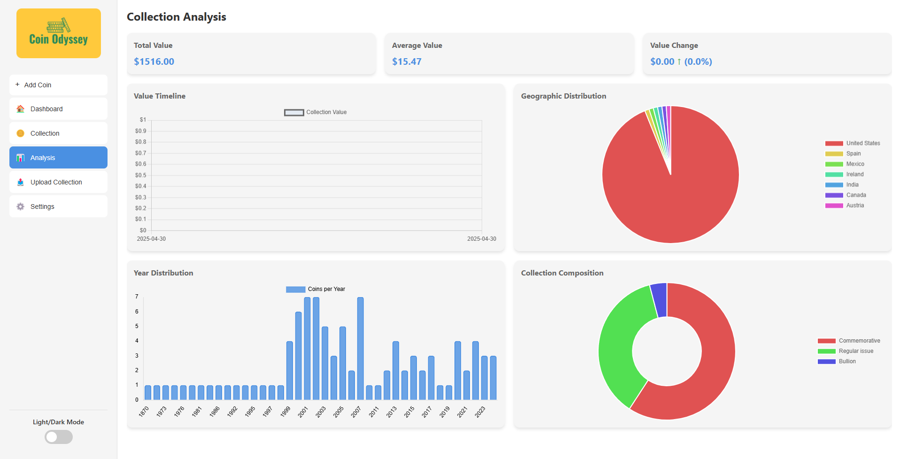
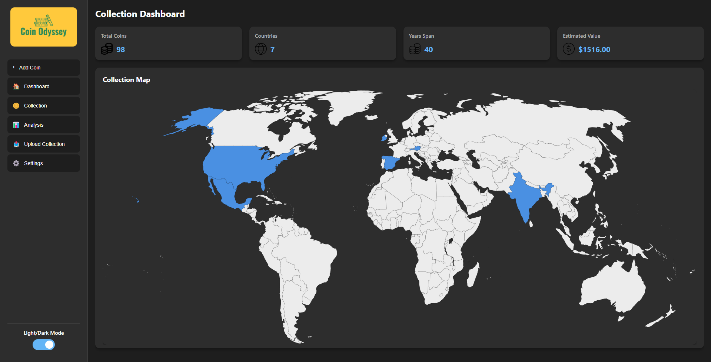
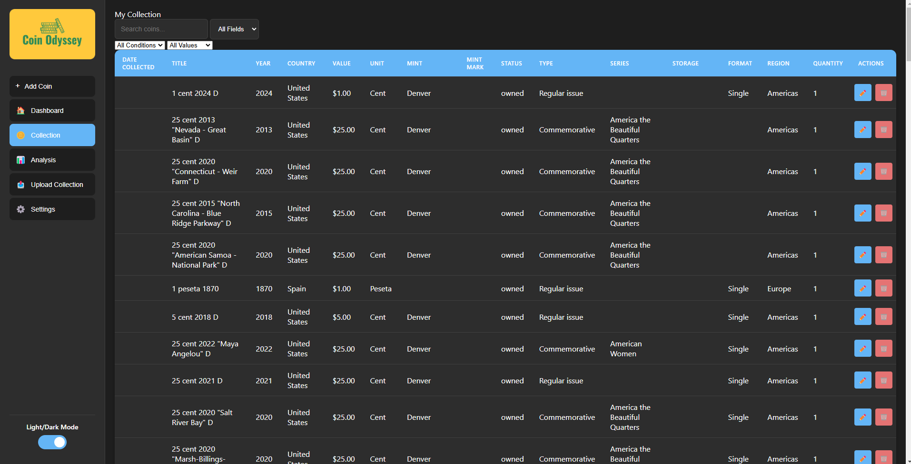
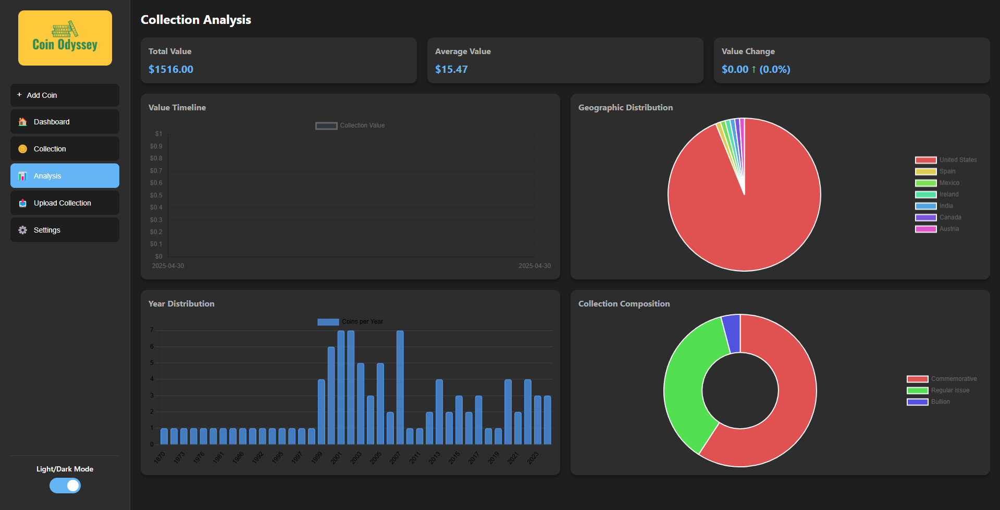

<div align="center">
  
  <h1>Coin Odyssey</h1>
  <p>A modern, feature-rich desktop application for coin collectors to manage and track their collections.</p>
</div>

## Overview

Coin Odyssey is an Electron-based desktop application designed to help numismatists manage their coin collections with ease. The application provides an intuitive interface for tracking coins, managing collections, and visualizing collection data through an interactive world map.

## Screenshots

### Light Mode
<div align="center">
  <h4>Dashboard</h4>
  
  
  <h4>Collection View</h4>
  
  
  <h4>Analysis</h4>
  
</div>

### Dark Mode
<div align="center">
  <h4>Dashboard</h4>
  
  
  <h4>Collection View</h4>
  
  
  <h4>Analysis</h4>
  
</div>

## Features

- **Interactive World Map**: Visualize your collection's geographic distribution with an interactive SVG map
- **Comprehensive Coin Management**: 
  - Add, edit, and track coins with detailed information
  - Upload images of both obverse and reverse sides
  - Track purchase dates, values, and conditions
- **Advanced Collection Organization**:
  - Filter and search through your entire collection
  - Sort by various attributes (country, year, value, etc.)
  - Organize coins by series, type, and storage location
- **Dynamic Dashboard**:
  - View collection statistics at a glance
  - Track total collection value
  - Monitor collection growth over time
- **Data Analysis**:
  - Geographic distribution charts
  - Collection composition breakdown
  - Value timeline tracking
  - Year distribution visualization
- **Modern UI**:
  - Clean, intuitive interface
  - Dark/Light mode support
  - Responsive design for various screen sizes

## Getting Started

1. **Installation**:
   ```bash
   # Clone the repository
   git clone https://github.com/yourusername/coin-odyssey.git
   
   # Navigate to project directory
   cd coin-odyssey
   
   # Install dependencies
   npm install
   ```

2. **Running the Application**:
   ```bash
   npm start
   ```

## Usage

1. **Adding Coins**:
   - Click the "Add Coin" button in the sidebar
   - Fill in coin details (title, year, country, etc.)
   - Upload obverse and reverse images if available
   - Click "Save" to add to your collection

2. **Viewing Collection**:
   - Use the "Collection" view to see all coins in a table format
   - Filter and sort using the controls above the table
   - Click on any coin to view detailed information

3. **World Map**:
   - Navigate to the "Dashboard" to see the world map
   - Hover over countries to see collection statistics
   - Click on countries to view coins from that region

4. **Managing Collection**:
   - Edit coin details at any time
   - Track purchase prices and current values
   - Organize coins by storage location
   - Export collection data as needed

5. **Data Import/Export**:
   - Backup your collection data
   - Import from CSV, Excel, or JSON files
   - Export your collection for safekeeping

## Technologies Used

- Electron.js
- Node.js
- SQLite
- HTML/CSS/JavaScript
- SVG for interactive mapping
- Chart.js for data visualization

## Using This Project

Feel free to fork this repository and adapt it for your own coin collection needs! While this is primarily a personal project, you're welcome to:

- Fork the repository and customize it for your collection
- Use it as a starting point for your own coin tracking application
- Modify the features to match your collecting style

If you create something cool with this code, I'd love to see it!

## Inspiration

This project was inspired by [OpenNumismat](https://github.com/OpenNumismat/open-numismat), an open-source coin collecting software. While building upon some of their core concepts, Coin Odyssey takes a modern approach with a focus on interactive visualization and user experience.

## Author

Created and maintained by Jason Alvarez

## License

This project is licensed under the MIT License - see the LICENSE file for details.